# HƯỚNG DẪN CÀI ĐẶT EVE-NG

EVE-NG (Emulated Virtual Environment - Next Generation) là nền tảng mô phỏng mạng mạnh mẽ, cho phép xây dựng và thực hành các lab networking phức tạp trong môi trường ảo hóa.

## 📋 Mục Lục
- [Yêu Cầu Hệ Thống](#yêu-cầu-hệ-thống)
- [Bước 1: Cài Đặt VMWare Workstation Pro](#bước-1-cài-đặt-vmware-workstation-pro)
- [Bước 2: Tải File Cài Đặt EVE-NG](#bước-2-tải-file-cài-đặt-eve-ng)
- [Bước 3: Cài Đặt Máy Ảo EVE](#bước-3-cài-đặt-máy-ảo-eve)
- [Cấu Hình Ban Đầu](#cấu-hình-ban-đầu)
- [Truy Cập Web Interface](#truy-cập-web-interface)
- [Lưu Ý Quan Trọng](#lưu-ý-quan-trọng)

## Yêu Cầu Hệ Thống

### Khuyến nghị tối thiểu:
- **CPU**: 4 cores trở lên
- **RAM**: 8GB trở lên (khuyến nghị 16GB)
- **Ổ cứng**: 50GB trở lên dung lượng trống
- **Hệ điều hành**: Windows 10/11

### Phần mềm cần thiết:
- VMWare Workstation Pro 17.x trở lên
- Trình duyệt web hiện đại (Chrome, Firefox, Edge)

---

## Bước 1: Cài Đặt VMWare Workstation Pro

Tải và cài đặt VMWare Workstation Pro:


File: [VMware-workstation-full-17.6.2-24409262.exe](https://onedrive.live.com/?cid=7f63085b39ff249e&id=7F63085B39FF249E!s14a29532141347a6b84a412917920241&resid=7F63085B39FF249E!s14a29532141347a6b84a412917920241&e=K4SM57&migratedtospo=true&redeem=aHR0cHM6Ly8xZHJ2Lm1zL3UvYy83ZjYzMDg1YjM5ZmYyNDllL0VUS1ZvaFFURktaSHVFcEJLUmVTQWtFQkVFdDUwVTB4NTRuUC1WTl9jNTltU3c_ZT1LNFNNNTc)


**Các bước cài đặt:**
1. Chạy file cài đặt với quyền Administrator
2. Làm theo hướng dẫn trên màn hình
3. Khởi động lại máy tính nếu được yêu cầu

---

## Bước 2: Tải File Cài Đặt EVE-NG

### Download EVE-NG Community Edition

1. Truy cập website chính thức: [https://eve-ng.net/](https://eve-ng.net/)
2. Vào phần **Download**
3. Kéo xuống phần **Free EVE Community Edition**
4. Download **EVE-NG CE Full ISO**

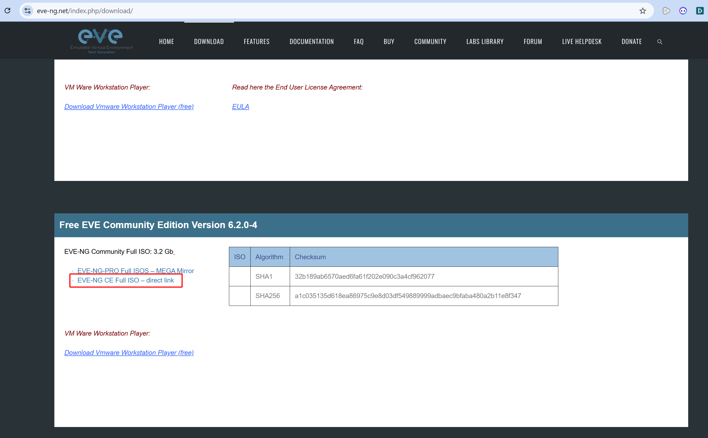

📦 Sau khi download, bạn sẽ có file ISO, ví dụ: **eve-ce-prod-6.2.0-4-full.iso**


---

## Bước 3: Cài Đặt Máy Ảo EVE

### 3.1. Tạo Virtual Machine Mới

1. Mở **VMware Workstation Pro**
2. Vào **File** > **New Virtual Machine**
3. Chọn **Typical**, click **Next**

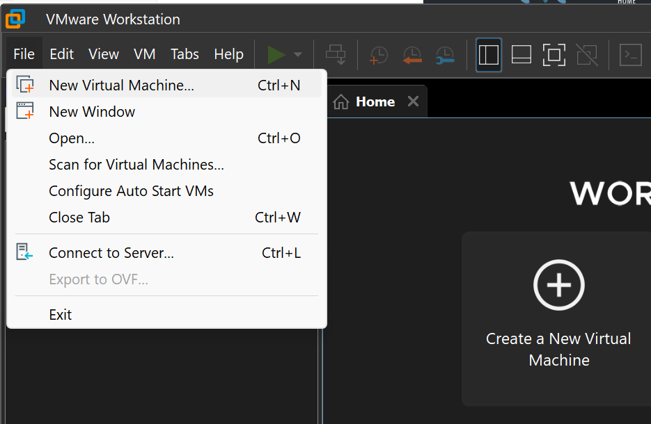

### 3.2. Chọn ISO File

1. Chọn **Installer Disc Image file (iso)**
2. Click **Browse** và tìm đến file ISO vừa tải
3. Click **Next**

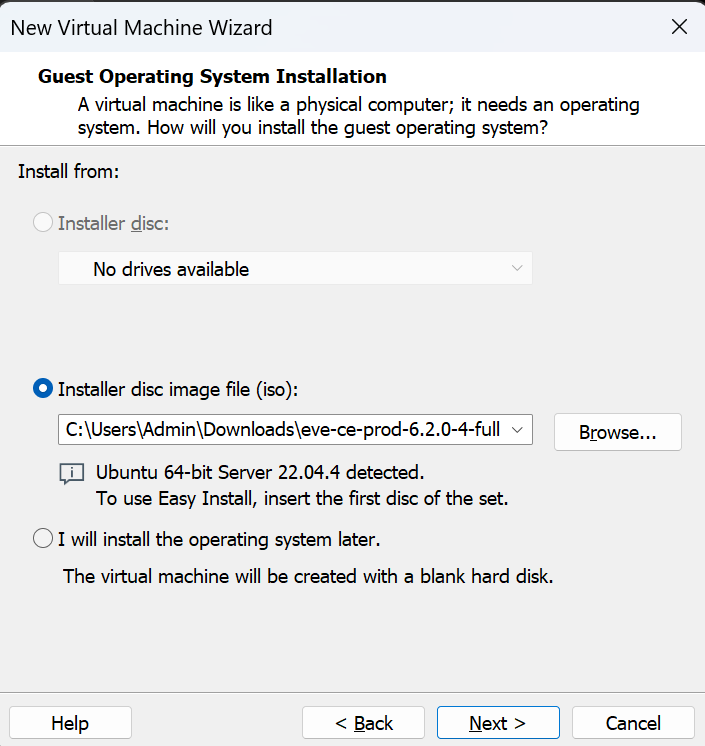

### 3.3. Đặt Tên và Vị Trí Lưu Trữ

1. Đặt tên cho máy ảo (VD: `EVE-NG-Lab`)
2. Chọn thư mục lưu trữ máy ảo
3. Click **Next**

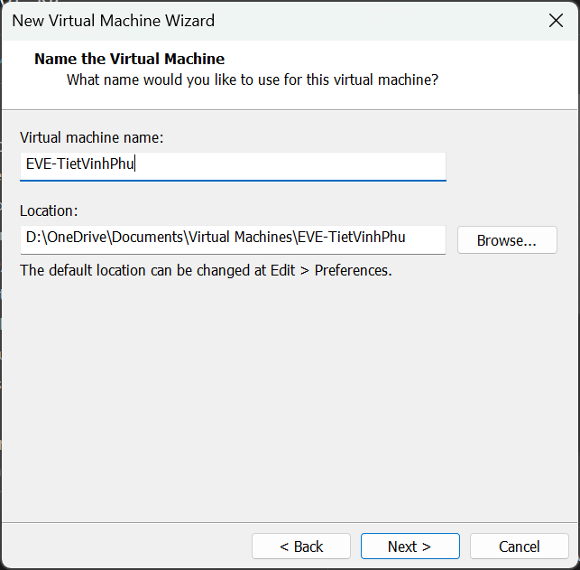

### 3.4. Cấu Hình Disk Size

**Khuyến nghị**: Đặt Disk Size cao để tránh phải mở rộng sau này

```
Minimum: 50GB
Recommended: 100GB+
```

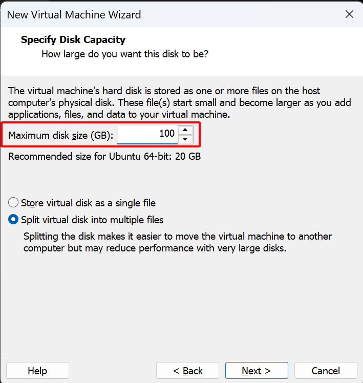

Click **Next** sau khi cấu hình xong.

### 3.5. Tùy Chỉnh Hardware

Click **Customize Hardware** và điều chỉnh:

| Thông số | Khuyến nghị |
|----------|-------------|
| **RAM** | 50-75% tổng RAM của máy host<br>(VD: máy 16GB → cấp 8-12GB) |
| **CPU** | 50-75% số cores của máy host<br>(VD: máy 8 cores → cấp 4-6 cores) |
| **Network Adapter** | NAT hoặc Bridged |


Click **Close** → **Finish** để hoàn tất.

---

## Cấu Hình Ban Đầu

### Quá Trình Cài Đặt

Máy ảo sẽ tự động khởi động và bắt đầu cài đặt. Chờ cho quá trình hoàn tất.


### Cấu Hình Hệ Thống

Sử dụng phím mũi tên (⬆️⬇️⬅️➡️) để di chuyển trong menu:

#### 1. Chọn Ngôn Ngữ
- Chọn **English**
- Bấm **Enter**

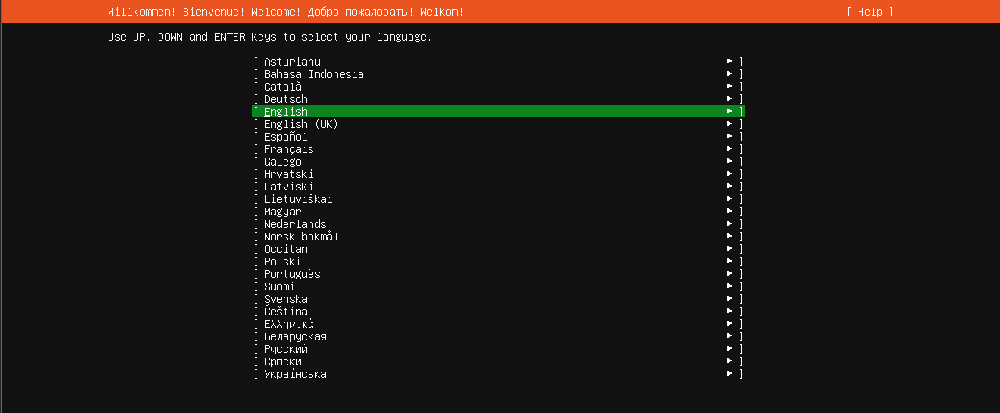

#### 2. Cấu Hình Disk
- Chọn **Done**
- Bấm **Enter**

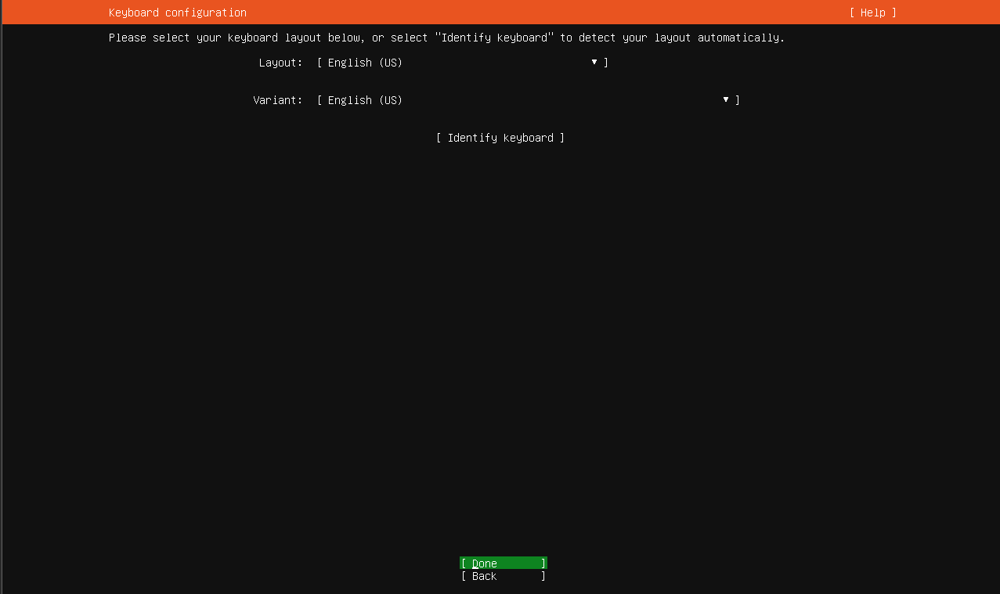

#### 3. Xác Nhận
- Chọn **Continue**
- Bấm **Enter**

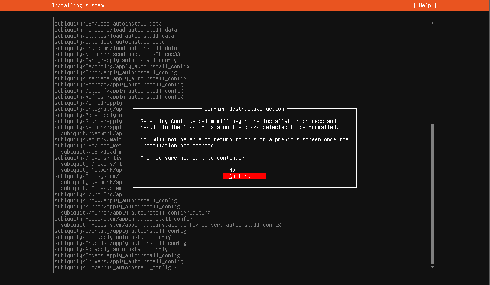

#### 4. Chờ Cài Đặt Hoàn Tất
Máy EVE sẽ tự động khởi động lại sau khi cài đặt xong.


### Cấu Hình Lần Đầu

#### Đăng Nhập
```
Username: root
Password: eve
```


#### Đặt Lại Password Root
⚠️ **Lưu ý**: Khi gõ password, ký tự sẽ không hiển thị trên màn hình. Gõ bình thường và bấm Enter.

1. Nhập password mới
2. Nhập lại password để xác nhận

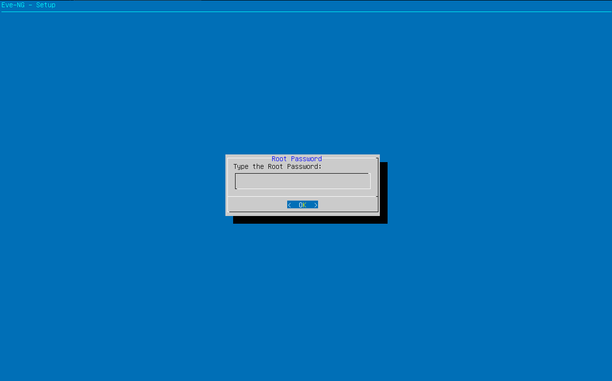

#### Cấu Hình Hostname
- Đặt hostname cho máy (có thể để mặc định)
- Bấm **Enter**

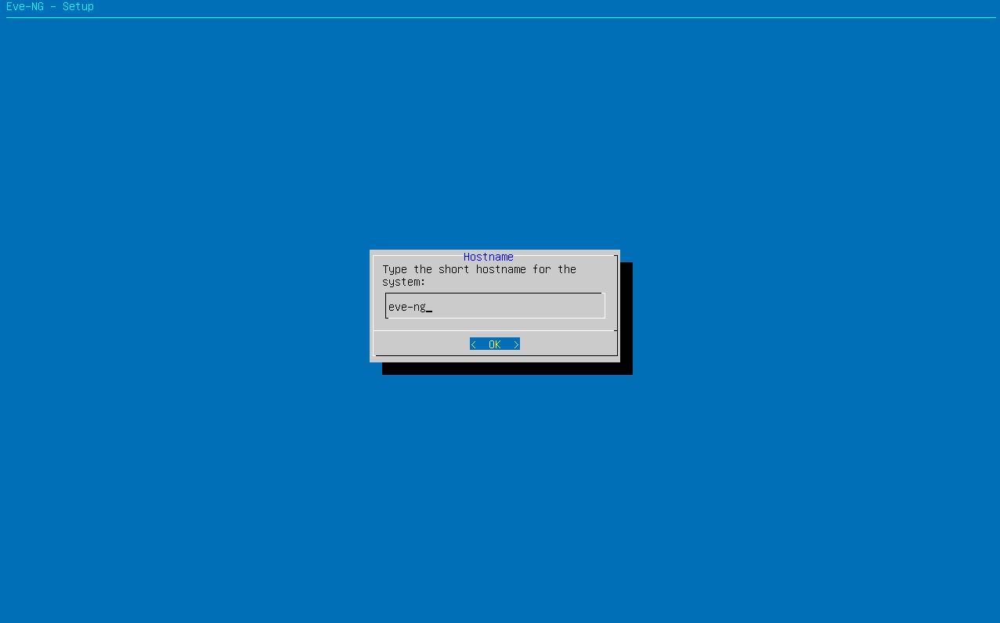

#### Cấu Hình Domain Name
- Đặt domain name (có thể để mặc định)
- Bấm **Enter**


#### Cấu Hình IP Address
- Chọn **DHCP**
- Bấm **Enter**


#### Cấu Hình NTP
- Bỏ qua bước này
- Bấm **Enter**

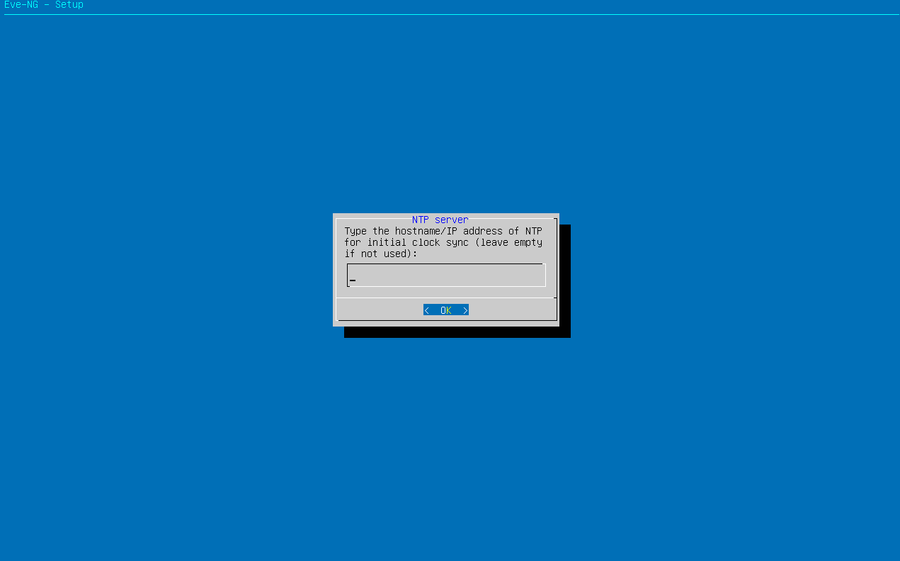

#### Cấu Hình Proxy
- Chọn **Direct Connection**
- Bấm **Enter**

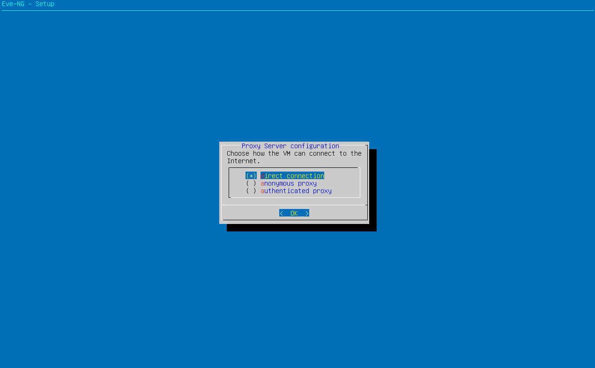

Chờ EVE khởi động lại.

---

## Truy Cập Web Interface

### Lấy Thông Tin Đăng Nhập

Sau khi khởi động xong, màn hình console sẽ hiển thị:

```
EVE-NG Console
URL: http://192.168.x.x
```

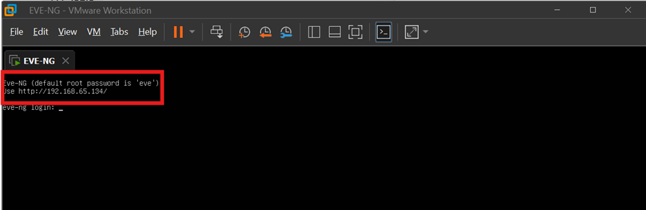

### Đăng Nhập Web UI

1. Mở trình duyệt web
2. Nhập địa chỉ: `http://<IP-của-máy-EVE>`
   - VD: `http://192.168.65.134`

**Thông tin đăng nhập Web Interface:**
```
Username: admin
Password: eve
```

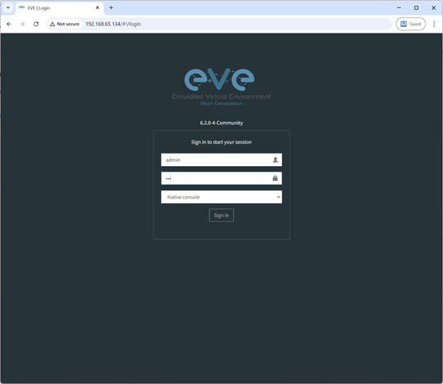

### Chọn Console Type

Bạn có 2 lựa chọn:

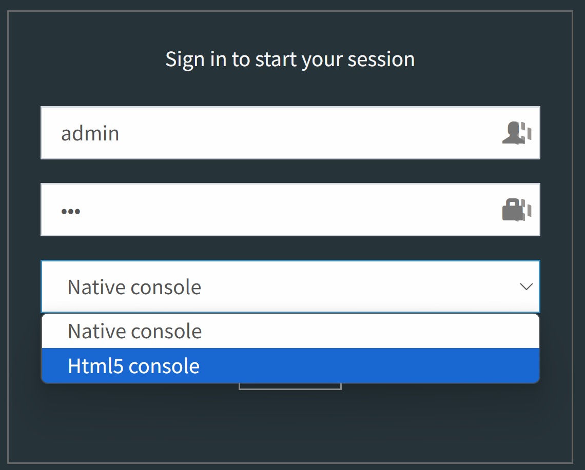

#### 🖥️ Native Console
- Sử dụng phần mềm terminal trên máy host
- **Yêu cầu**: Cài đặt **Windows Client Side Pack**
- **Download**: [EVE-NG Downloads](https://www.eve-ng.net/index.php/download/)
  - Kéo xuống phần **Windows Client Side**

#### 🌐 HTML5 Console
- Kết nối qua trình duyệt web
- Không cần cài đặt thêm phần mềm
- **Khuyến nghị** cho người mới bắt đầu

---

## Lưu Ý Quan Trọng

### ⚙️ Cấu Hình Hiệu Năng
- Đặt RAM và CPU cao hơn nếu muốn chạy nhiều thiết bị trong lab
- Theo dõi resource usage khi chạy lab phức tạp

### 🔐 Bảo Mật
- Đổi password mặc định ngay sau khi cài đặt
- Không expose EVE-NG ra internet trực tiếp
- Sử dụng VPN nếu cần truy cập từ xa

### 💾 Backup
- Định kỳ backup các lab của bạn
- Export cấu hình thiết bị quan trọng

### 📚 Tài Nguyên Học Tập
- [EVE-NG Documentation](https://www.eve-ng.net/index.php/documentation/)
- [EVE-NG Community Forum](https://www.eve-ng.net/index.php/community/)
- [EVE-NG Cookbook](https://www.eve-ng.net/index.php/documentation/eve-ng-cookbook/)

---

## 📞 Hỗ Trợ

Nếu gặp vấn đề trong quá trình cài đặt:
1. Kiểm tra lại các bước cài đặt
2. Xem log trong VMware console
3. Tham khảo [EVE-NG Forum](https://www.eve-ng.net/index.php/community/)
4. Tạo issue trên repository này

---

## 📄 License

Hướng dẫn này được tạo ra cho mục đích giáo dục và chia sẻ kiến thức.

---

**⭐ Nếu hướng dẫn này hữu ích, đừng quên star repo này!**
